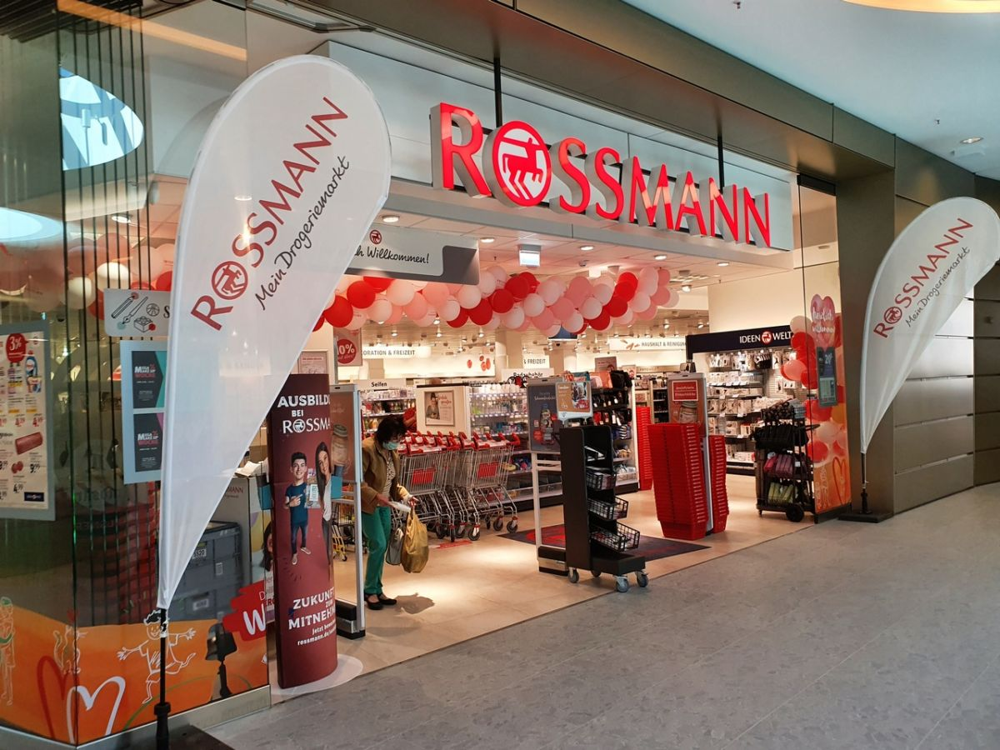
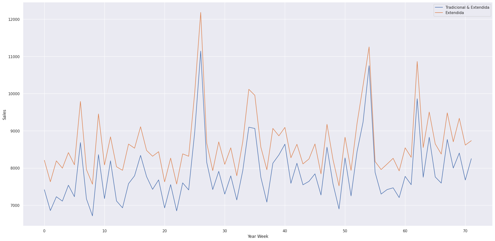
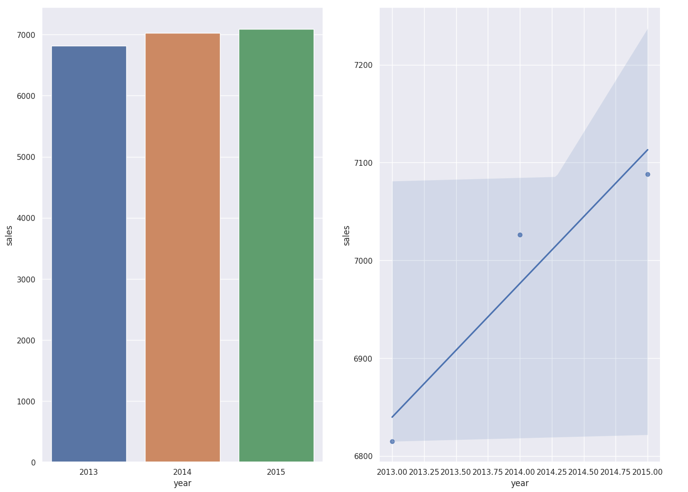
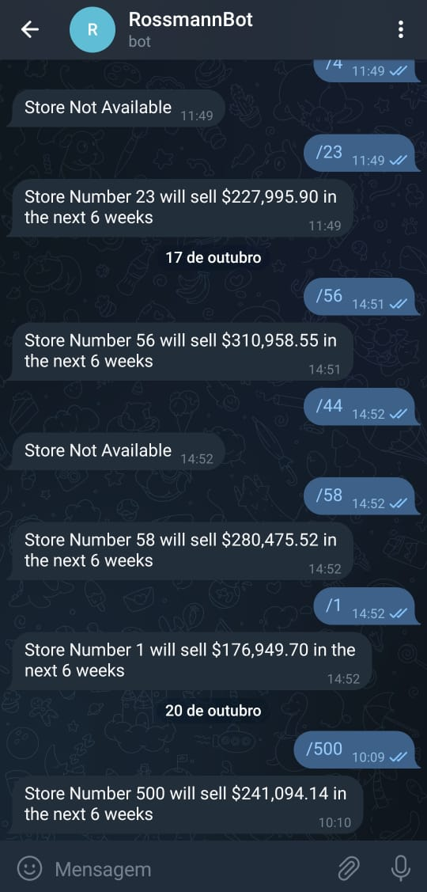

# Rossmann Sales Forecast

## Conhecendo o negócio
Rossmann é uma das maiores redes de drogarias da Europa, operando mais de 3.000 lojas em 7 países da Europa. Com o intuito de realizar investimentos e melhorias em suas lojas os gerentes receberam do CEO a tarefa de prever o faturamento de vendas das próximas 6 semanas.

## 1. Questão de negócio
Prever as vendas realizadas por todas as lojas nas próximas 6 semanas. Com milhares de gerentes individuamente realizando previsões baseadas em suas circunstâncias únicas, a acurácia pode variar consideravelmente.

### 1.1. Entendendo os dados
A base de dados é referente as vendas realizadas entre 01/01/2013 e 31/07/2015 para 1.115 lojas. As vendas das lojas são influenciadas por diversos fatores, como promoções, localização de competidores e escolas, feriados e sazonalidade.

|Atributo| Definição|
|--------|----------|
|Id| um id que representa uma loja e data no dataset|
|Store| um id único para cada loja|
|Sales| a receita em determinado dia|
|Customers| o número de clientes em determinado dia|
|Open| um indicador se a loja estava aberta: 0 = fechada, 1 = aberta|
|StateHoliday| indica um feriado estadual. Normalmente todas as lojas, com algumas exceções, estão fechadas em feriados estaduais. Todas as escolas estão fechadas em feriados públicos e fins de semana. a = public holiday, b = Easter holiday, c = Christmas, 0 = None.|
|SchoolHoliday| indica se a loja foi afetada por escolas públicas fechadas|
|StoreType| diferencia entre 4 modelos de loja: a, b, c, d|
|Assortment| descreve um nível de sortimento: a = basic, b = extra, c = extended|
|CompetitionDistance| distância em metros da loja competidora mais próxima|
|CompetitionOpenSince[Month/Year]| ano e mês aproximados da abertura do competidor mais próximo|
|Promo| indica se a loja está aplicando uma promoção no dia|
|Promo2| continuação consecutiva da promoção para algumas lojas: 0 = a loja não está participando, 1 = a loja está participando|
|Promo2Since[Year/Week]| descreve o ano e semana do calendário quando a loja começou a participar na Promo2|
|PromoInterval| descreve os intervalos consecutivos de início, nomeando os meses que a promoção recomeça. Ex.: 'Feb,May,Aug,Nov' significa que cada rodada começa em Fevereiro, Maio, Agosto, Novembro de qualquer ano para a loja|

## 2. Premissas de neǵocio
* Os valores nulos em 'CompetitionDistance' foram substituidos por a maior distância multiplicada por 3, pois estas observações provavelmente indicam lojas à uma distância muito alta, o que significa que não há competição.
* Dias com valores de vendas zerado foram desconsiderados.
* Dias onde as lojas estavam fechadas foram desconsiderados.
* Os valores faltantes na coluna 'CompetitionOpenSince' e 'Promo2Since' foram definidos com os valores de ano e mês da coluna 'Date'.

## 3. Planejamento da solução
O planejamento foi dividido em três etapas:

### 3.1. Produto Final
O resultado entregue será um aplicativo que apresente as previsões de vendas das próximas 6 semanas, facilitando e agilizando o acesso a informação.

### 3.2. Processo
#### _Entendendo o problema de negócio_
Entender a motivação para a previsão e assim planejar a solução mais efetiva.

#### _Coleta de dados_
Coleta dos dados das lojas e vendas na plataforma [Kaggle](https://www.kaggle.com/competitions/rossmann-store-sales/data).

#### _Limpeza dos dados_
Colunas renomeadas, tipo dos dados alterados e colunas com valores nulos preenchidas.

#### _Análise Exploratória de Dados (AED)_
Exploração dos dados para entendimento de negócio e descoberta de insights para auxílio na determinação de features no treinamento do modelo de machine learning.

#### _Feature Engineering_
Criação de novas features derivadas das originais para o uso no modelo de machine learning.

#### _Preparação dos dados_
Aplicação de técnicas de normalização, rescaling e encoding dos dados, assim como transformação da variavél resposta.

#### _Feature Selection_
Seleção das features relevantes que serão utilizadas para treinamento do modelo através do algoritmo Boruta.

#### _Machine Learning Modeling_
Treinamento de algoritmos de Regressão com cross-validation em Time Series. O modelo selecionado foi aperfeiçoado com Hyperparameter fine tuning.

#### _Avaliação do Modelo_
Avaliação do modelo treinado utilizando das seguintes técnicas: MAE, MAPE e RMSE.

#### _Resultados Financeiros_
Tradução do resultado para valores de negócio.

#### _Deploy do Modelo (Telegram Bot)_
Implementação da API para previsão de vendas através do aplicativo Telegram.

### Ferramentas
* Python 3.8
* Pandas, Seaborn, Matplotlib e Sklearn
* Flask e Python API's
* Git e Heroku
* Boruta
* Algoritmos de Regressão (Regressão Linear/Lasso, Random Forest, XGBoost/LGBM Regressors)
* Cross-Validation, Hyperparameter Optimization
* Métricas de Performance (RMSE, MAE, MAPE)

## 4. Destaque dos Insights de negócio
Na exploração de dados, foram levantadas diferentes hipóteses para melhor entendimento do comportamento de cada atributo.
Dentre as hipóteses, os seguintes insights foram destacados.

### Lojas com promoções consecutivas vendem menos.

### Lojas vendem mais ao longo dos anos.

## 5. Modelos de Machine Learning
Foram treinados 6 modelos de machine learning para previsão das vendas, com cross-validation:
* Média (utilizado como Baseline)
* Regressão Linear
* Regressão Linear Regularizada (Lasso)
* Random Forest Regressor
* XGBoost Regressor
* LightGBM Regressor

Abaixo estão as performances de cada modelo em ordem crescente:

| Modelo | MAE | MAPE | RMSE |
|--------|-----|------|------|
| Random Forest Regressor| 732,62 +/- 120,76| 0,11 +/- 0,02| 1094,54 +/-183,61|
|LightGBM Regressor| 932,66 +/- 84,96|0,13 +/- 0,01|1333,97 +/- 122,36|
|XGBoost Regressor| 984,36 +/- 114,39|0,14 +/- 0,01|1425,7 +/- 179,24|
| Média (Baseline) |1354,80| 0,2064| 1835,14|
|Linear Regression| 1905,59 +/- 100,99|0,29 +/- 0,01| 2724,06 +/- 162,77|
|Lasso Regression|1922,33 +/- 109,47| 0,29 +/- 0,1| 2745,56 +/- 195,84|

Os modelos de Regressão Linear e Regressão Regularizada apresentaram performances inferiores ao modelo simples de Média, o que mostra que o comportamento dos dados não é linear, e conduz as análises para modelos mais complexos.

Mesmo o modelo de Random Forest apresentando a melhor performance, o modelo escolhido para prosseguimento e otimização dos hiperparâmetros foi LightGBM. Pois consome muito menos tempo para treinamento e otimização que o primeiro, permitindo um estudo maior de diferentes configurações dos hiperparâmetros.

Após a otimização dos hiperparâmetros do modelo, sua performance foi melhorada:

|Modelo| MAE | MAPE | RMSE |
|------|-----|------|------|
| LGBM Regressor | 657,30852 | 0,096696 | 955,729333 |

### Entendendo as métricas
A raiz quadrada do erro médio (RSME) é ideal para medir performance do modelo mas não é a melhor para dizer a performance financeira.

Já MAE (Erro Absoluto Médio) e MAPE (Erro Percentual Absoluto Médio) traduzem melhor os resultados em performance de negócio. Apresentam quanto o modelo erra na média e na média em porcentagem, respectivamente.

## 6. Resultado de Negócio
Com os valores de MAE e MAPE podemos calcular o pior e melhor cenário de cada previsão.

|Loja| Predição | Pior cenário | Melhor cenário | MAE | MAPE |
|----|----------|---------|---------------------|-----|------|
| 1 | 164.954,76 | 164.666,12 | 165.249,40 | 291,64| 0,066|
|2|180.143,43|179.734,93|180.551,94|408,50|0,084|
|3|258.013,06|257.424,94|258.601,18|588,12|0,082|
|...|...|...|...|...|...|
|1115|252.369,66|251.818,37|252.920,96|551,30|0,077|

Considerando as predições de todas as loja nos três cenários, os valores de vendas nas próximas seis semanas são:

| Cenário | Valores |
|---------|---------|
|Predição|€ 286.351.257,77|
|Pior cenário|€ 285.614.249,52|
|Melhor cenário|€ 287.088.266,02|

## 7. Deploy do Modelo
Para facilitar o acesso, o modelo foi implantado no serviço em nuvem Heroku, com os resultados completos para cada loja, que pode ser consultado através do Telegram Bot.

Para fazer a consulta, basta enviar uma mensagem no formato "/store_number" (ex: /50). O Bot responderá com o valor previsto para as próximas seis semanas, ou caso o número da loja não exista ou qualquer outro tipo de mensagem, apresentará a mensagem "Store not available".

  

## 8. Conclusão
O objetivo do projeto foi alcançado, com o modelo em produção realizando a previsão das vendas para todos os gerentes, permitindo ao CEO tomar decisões de melhoria com maiores precisão.

## 9. Próximos passos
* Formular novas hipóteses para buscar insights.
* Aplicar ARIMA para predizer o total de clientes nas próximas semanas, que podem ser implementados ao modelo de previsão de vendas.
* Aplicar outros modelos de regressão para análise de performance.
* Otimizar ainda mais o modelo por outros métodos (Bayesiana, GridSearch).
* Melhorar a experiência do usuário na interação com o Bot.